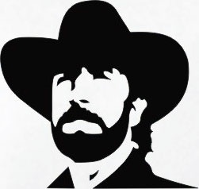

# Norrisbot


## Introduction
Norrisbot is a Slack application that can recant some of the best Chuck Norris
jokes around, as well as show you some related GIFs.

## Features
- Random joke selection from a set of hundreds.
- Joke of the day which changes daily.
- Giphy integration for Chuck Norris related GIFs.

## Usage
1. Create a bot user for your team and get the Slack Token.
2. Find a [Giphy API token](https://github.com/Giphy/GiphyAPI#public-beta-key)
   that can be used for your bot.
3. Start the bot with the following command from within `src/`:


   ```SLACK_TOKEN=INSERT_TOKEN GIPHY_TOKEN=INSERT_TOKEN npm start```
